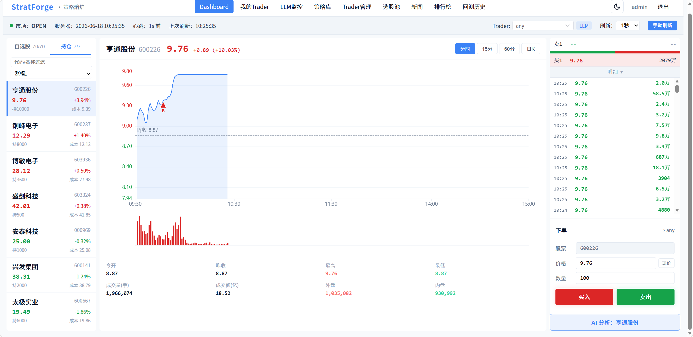
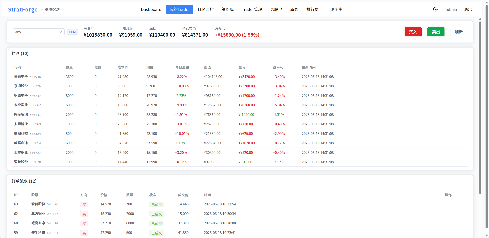
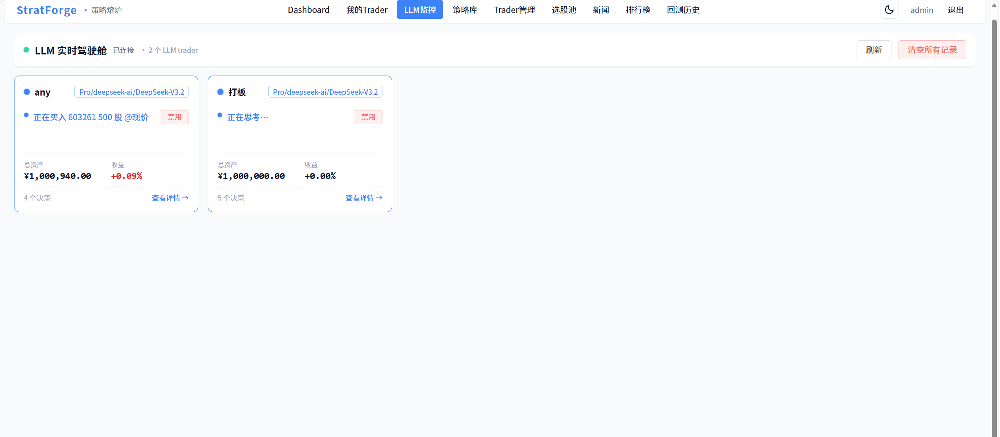
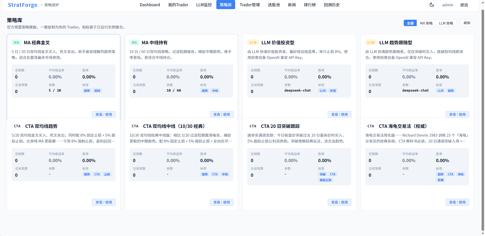
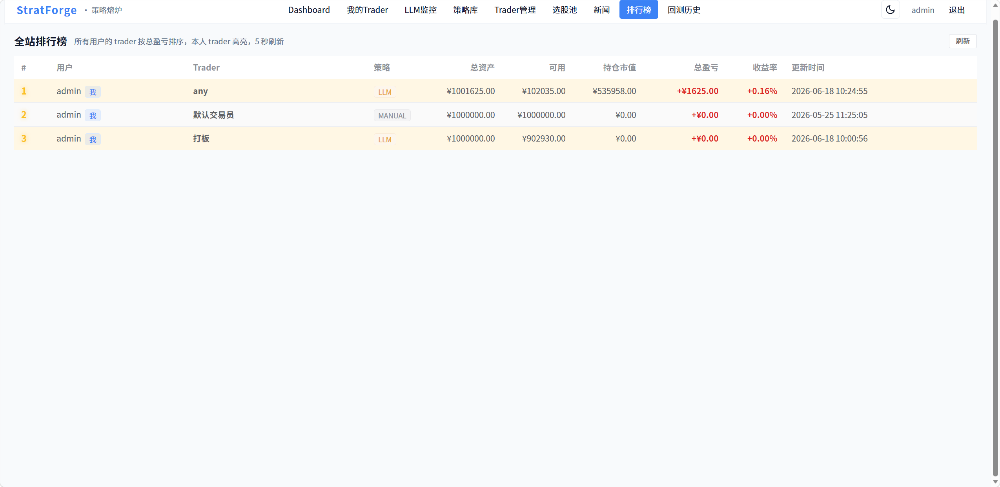
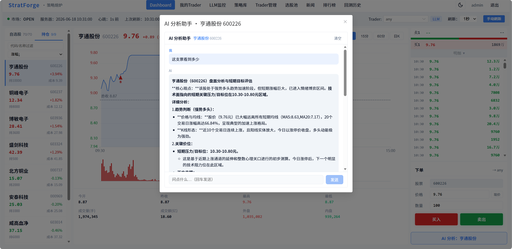

# StratForge · 策略熔炉

> **多策略量化交易决策与回测平台** —— 聚合 A 股行情时序数据，多策略并行调度，沙盒虚拟撮合，专业回测与 AI 决策可解释性分析。

<p>
  
  
  
  
  
  
</p>

个人独立开发的全栈项目，已 Docker 化部署上线公网。平台**不接入任何真实下单通道，纯沙盒环境**：每个 AI 交易员在独立虚拟账户（初始 ¥1,000,000）中运行 MA、LLM 大模型、CTA 趋势等多类策略，由调度器并行驱动，撮合引擎按真实行情快照模拟成交，遵循 A 股 T+1、涨跌停板、滑点规则，并产出夏普、最大回撤等专业回测指标。

---

## ✨ 技术亮点

> 项目中几处偏底层、非模板化的核心设计。

- **🔒 撮合引擎的资金守恒与并发一致性**
  多个 AI 交易员叠加用户手动下单会并发修改同一账户。以 `余额 + 冻结资金 + Σ持仓市值 == 本金 + 总盈亏` 作为**资金守恒不变量**贯穿全链路校验，并用**按交易员 ID 的细粒度锁**替代全局锁，兼顾并发吞吐与账目零差错。

- **📈 A 股真实交易规则的高还原度**
  拒绝「现价即成交」的简化模型，还原**涨跌停板排队语义**（一字板全拒 / 触板按概率成交 / 否则保留挂单重试），涨跌停幅度按板块区分（创业板·科创板 20% / ST 5% / 主板 10%），叠加 T+1 限制，让回测结果真正具备参考价值。

- **🧠 LLM 决策闭环（落库 → 后验反思 → 经验回灌）**
  针对大模型「无记忆、反复押同一标的、看不到历史对错」的痛点，设计自我校准闭环：每笔下单落库快照 → 后台 Worker 数日后用真实涨跌**后验反思**判定决策对错 → 将「近 30 天准确率 + 最近若干条结果」回灌进下一轮 prompt，用提示工程模拟「经验积累」，不依赖模型微调。

- **📡 数分钟级 AI 决策的实时可观测与可干预**
  LLM 单次决策需多轮工具调用、耗时十几秒至数分钟。通过 **SSE 流式推送**实时展示决策链路，并支持**一键即时中断**：用 `Thread.interrupt()` 直接打断阻塞在网络请求上的线程，而非等待超时，并在下一轮请求前二次校验，杜绝「窗口期下错单」。

---

## 🏗️ 系统架构

```
┌──────────────┐      ┌──────────────────────────┐      ┌─────────────────────┐
│  Vue3 前端   │ ───▶ │      Java 业务后端        │ ───▶ │   Python 数据网关   │
│ Vite + Pinia │ HTTP │       Spring Boot         │ HTTP │       FastAPI        │
│  ECharts     │ /SSE │  SQLite · 沙盒撮合引擎    │      │  行情数据源 SDK     │
│              │      │  多策略调度 · 回测引擎    │      │  监控列表 / 标的池  │
└──────────────┘      └──────────────────────────┘      └─────────────────────┘
                                                                    │
                                                                    ▼
                                                            公开行情数据源
```

| 模块 | 技术栈 | 端口 | 核心职责 |
|------|--------|------|----------|
| **Python 数据网关** | FastAPI · mootdx · akshare · APScheduler | 8000 | 行情快照、日 K、监控列表、标的池、新闻情绪 |
| **Java 业务后端** | Spring Boot · MyBatis-Plus · SQLite · JJWT | 8080 | 鉴权、虚拟账户、沙盒撮合、多策略调度、回测、模板市场 |
| **Vue3 前端** | Vue3 · TypeScript · Vite · Pinia · ECharts · Element Plus | 5173 | Dashboard / MyTrader / Leaderboard / 策略库 / 回测报告 / LLM 驾驶舱 |

**为什么是三段式异构架构？** 行情数据源 SDK 生于 Python 量化生态（mootdx / akshare），故数据网关用 FastAPI；业务侧的事务、并发、强一致逻辑（撮合、调度、鉴权）交给 Spring 生态成熟的 Java 后端；二者通过 HTTP 解耦，各用所长。

---

## 🎯 核心能力

- **多策略并行调度** —— 基于 `StrategyExecutor` 接口统一抽象 MA 双均线 / LLM 大模型 / INDICATOR 指标规则 / SCRIPT JS 脚本 / CTA 趋势五类策略；主调度间隔可配，并通过**市场状态边沿检测**在开盘/集合竞价瞬间（9:15 / 9:30 / 12:57 / 13:00）补触发，规避固定轮询的延迟。
- **沙盒虚拟撮合** —— `MatchEngine` 定时 tick 按最新行情撮合，T+1、涨跌停排队、资金守恒，按交易员粒度加锁。
- **LLM 自主交易** —— 基于 OpenAI 兼容协议 function calling，大模型自主调用行情/新闻/下单工具完成多轮决策；可对接 DeepSeek / Kimi / GLM 等国产模型。
- **专业回测系统** —— 五策略统一回测，输出夏普 / 索提诺 / Calmar / 年化收益 / 胜率（FIFO 配对）/ 盈亏比 + 沪深 300 基准对比 + 月度收益热力图。
- **AI 决策可解释** —— LLM 实时决策驾驶舱（SSE + 中断）、决策落库与后验反思、新闻情绪注入。
- **标的池管理** —— 按板块 / 价格 / 市值 / K 线技术条件分步筛选落盘，多交易员按池子分组复用行情上下文。

---

## 📸 功能预览

### Dashboard 行情看板
分时 / K 线图 + 五档盘口 + 逐笔成交 + 快速下单，左栏自选股 / 持仓按涨幅排序。



### 我的 Trader
虚拟账户总览：持仓明细（成本 / 现价 / 盈亏）+ 订单流水。



### LLM 实时驾驶舱
多 LLM Agent 实时决策监控，SSE 推送当前动作 + 总资产 / 收益，可一键禁用或查看详情。



### 策略库
官方预置策略模板（MA / LLM / CTA），一键复制为自己的 Trader。



### 全站排行榜
所有用户的 Trader 按总盈亏排序，本人 Trader 高亮，5 秒刷新。



### AI 分析助手
感知当前选中股票，多轮对话式盘面分析，Markdown 渲染输出。



---

## 🚀 快速开始

### 环境准备
- **JDK 17**、**Maven 3.6+**、**Python 3.10+**、**Node 18+**
- **监控股票列表**：从公开行情终端导出 `.sel` 标的列表放到 `doc/自选股.sel`（路径可在 `gateway-python/app/config.py` 调整）。仅启动前做一次，运行时不依赖任何桌面客户端。

### 1. 启动 Python 数据网关
```bash
cd gateway-python
cp .env.example .env        # 修改 GATEWAY_TOKEN
./run.bat                    # Windows
# 验证：curl http://localhost:8000/health
```

### 2. 启动 Java 后端
```bash
cd backend-java
cp src/main/resources/application.yml.example src/main/resources/application.yml
# 填入 gateway token（与网关一致）和 JWT secret
mvn spring-boot:run
# 验证：curl http://localhost:8080/api/quote/gateway-health
```
业务接口需 JWT：先 `POST /api/auth/register` 拿 token，再带 `Authorization: Bearer <token>` 访问。

### 3. 启动前端
```bash
cd frontend-vue
npm install
npm run dev
# 浏览器打开 http://localhost:5173，注册账号后自动创建默认虚拟账户
```

> 根目录 `start-all.bat` 可依次启动三端，`stop-all.bat` 一键关闭。

### Docker 部署
仓库已 Docker 化（nginx + java + python 三容器），`deploy/deploy.sh` 一键构建并发布，详见 [`deploy/README.md`](deploy/README.md)。

---

## ⚠️ 关键避坑点

- **网关 Token**：内网穿透 / 公网部署务必修改 `GATEWAY_TOKEN`，否则接口会被爆刷。
- **数据源限频**：行情 SDK 已做全局单例 + TTL 缓存（默认 1s），底层数据源对密集请求不友好。
- **非交易时段**：数据源返回空时自动走 fallback 缓存或返回 `market_status=CLOSED`。
- **资金守恒不变量**：`余额 + 冻结 + Σ(持仓 × 现价) == 本金 + 总盈亏`，改动账逻辑时务必保持等式成立。

---

## 📂 项目结构

```
aiTrade/
├── gateway-python/     # FastAPI 数据网关：行情、标的池、新闻
├── backend-java/       # Spring Boot 业务后端：撮合、调度、回测
├── frontend-vue/       # Vue3 前端：行情看板、驾驶舱、回测报告
├── deploy/             # Docker 部署脚本与运维手册
├── doc/                # 截图、监控列表样例
└── docker-compose.yml
```

---

## 📌 路线图

- [x] 沙盒虚拟撮合（T+1 / 涨跌停 / 资金守恒）
- [x] 五类策略并行调度 + 边沿补 tick
- [x] LLM 自主交易 + 决策落库 + 后验反思
- [x] LLM 实时驾驶舱（SSE + 一键中断）
- [x] 专业回测报告（夏普 / 索提诺 / Calmar + 沪深 300 基准 + 月度热力图）
- [x] 标的池 / 多池子分组管理
- [x] 新闻情绪注入 LLM 决策
- [x] 日 / 夜双主题
- [ ] LLM × MA 信号融合
- [ ] 因子库（动量 / 波动率 / 成交量因子）

---

> 本项目为个人技术学习与工程实践之作，**仅用于策略研究与回测，不构成任何投资建议**。
